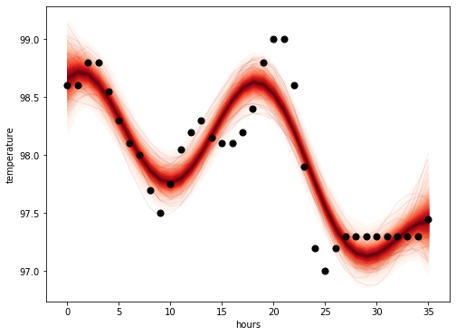

# [Early Prediction of Hospital Acquired Sepsis](https://www.youtube.com/watch?v=Kldc6i-R0X8&feature=emb_title)

In a collaboration with the UCSF School of Medicine, our research is on the development of a model for the early prediction of hospital acquired sepsis. Several features differentiate this research from current sepsis models in research and production: training a model using the UCSF information commons database, extensive feature engineering, labeling patients based on the most reliable definition of sepsis, and focusing on a non-ICU ward. We achieved state of the art results with an AUCPR of 0.67 four hours before onset using the leading model, a multi-task gaussian process and recurrent neural network, and comparable results with tree-based models trained with expert engineered features.

# [Math to Code](http://math2code.com/)
Web application to convert pictures of math to functioning Python code.
---
